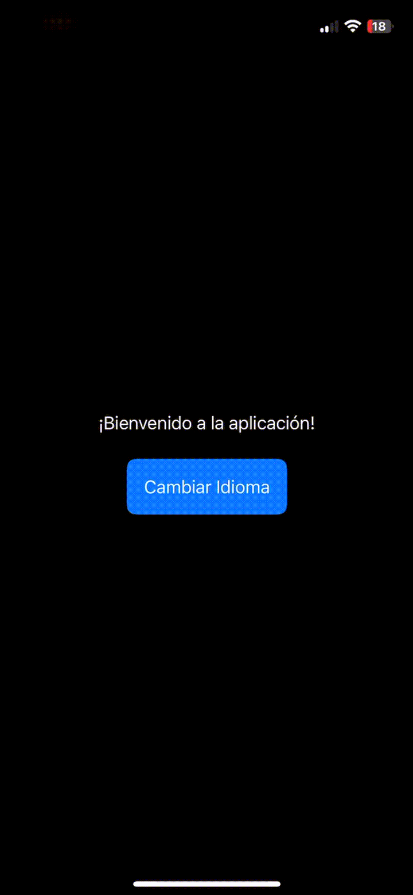

# Dynamic Languate
Sample iOS project that shows a sample app changes language view on the fly, it also provides snapshot test for validating views on app different languages. This is the basecode for following post  [Visual Regresion Testing: Implementing Snapshot test on iOS](https://javios.eu/test/snapshot-test-on-ios/)

## Screenshots - ISP principle in Swift

## Requirements

- **Xcode 15.0 or later**
- **iOS 16.0 or later**
